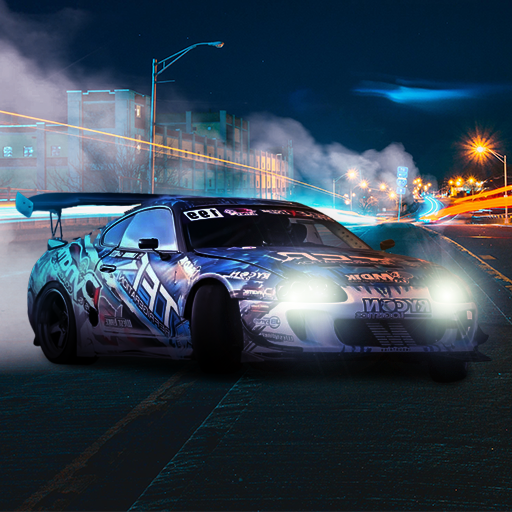

<div align="center">
    <h1>Night City Drift</h1>
</div>

<table style="margin-left: auto; margin-right: auto; width: 100%; border: none;">
<tr>
    <td style="text-align: center; width: 30%; border: none;">
        
    </td>
    <td style="text-align: left; vertical-align: middle; width: 70%; border: none;">
        <strong>Night City Drift</strong> — это динамичный симулятор дрифта в ночном городе, созданный на Unity с использованием WebGL. Настраивайте машины, осваивайте заносы под огнями небоскребов и соревнуйтесь за звание лучшего.
    </td>
</tr>
</table>

<div align="center">
    <i><a href="https://www.youtube.com/watch?v=dQw4w9WgXcQ"><strong>Игра доступна на Яндекс Играх</strong></a></i>
</div>

<div align="left">
    <h1>Геймплей</h1>
</div>

- Дрифтуйте по улицам с огнями небоскрёбов, погружайтесь в атмосферу ночного города.

<div align="center">
    
</div>

- Меняйте цвет машины и колёс, улучшайте двигатель и выбирайте номер, чтобы создать уникальный автомобиль.

<div align="center">
    
</div>

- Настраивайте игру под себя: изменяйте параметры и выбирайте саундтрек для идеального настроения.

<div align="center">
    
</div>

<div align="center">⠀</div>

<div align="left">
    <h1>FAQ</h1>
</div>

#### Управление
- **На ПК**: Передвижение на WASD. Для дрифта используйте **Пробел** (ручник). Тормоз — **S**, руль — **A** и **D**.  
- **На мобильных устройствах**: Используйте экранные кнопки: газ, тормоз, руль и ручник — управляйте касанием.

#### Игровой процесс
Выберите машину, настройте её в гараже, подберите музыку и отправляйтесь в ночной город! Дрифтуйте на улицах или на хайвее, зарабатывайте очки за длинные заносы и соревнуйтесь за звание лучшего.

#### Сохранение прогресса
Все ваши достижения сохраняются автоматически, чтобы вы могли продолжить с того места, где остановились.

---

<div align="left">
    <h1>Установка</h1>
</div>

<div align="left">
Игра доступна на <strong>Яндекс Играх</strong> под названием Дрифт: Ночная Суета. Для локальной разработки или тестирования:

1. Склонируйте репозиторий:
   ```bash
   git clone https://github.com/Tushev-Dmitriy/Night-City-Drift.git
2. Откройте проект в Unity (рекомендуемая версия: 2022.3.55f1).
3. Выберите сцену <code>init</code> и запустите её.
</div>
